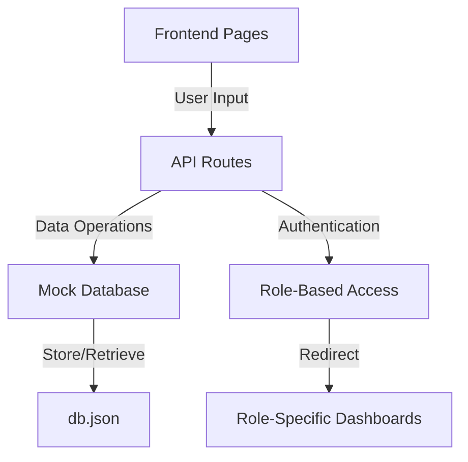

# Medication Assistant Documentation

Welcome to the Medication Assistant documentation! This guide will help you understand how our system works, from the database structure to authentication flows.

## Documentation Structure

### 1. [Database and Authentication](./database-and-auth.md)
- Overview of the mock database system
- Authentication flow explanation
- API routes and data flow
- Next.js integration details
- Production considerations

### 2. [Data Models](./data-models.md)
- Detailed data structure explanations
- Entity relationships
- Example scenarios
- Common queries
- Best practices
- Migration guidelines

### 3. [Development Guide](./development-guide.md)
- Setup instructions
- Development workflow
- Testing procedures
- Common tasks
- Troubleshooting
- Next steps

### 4. Application Structure
- [App Directory and Components](./app-structure.md)

### 5. Architecture Documents
- [System Architecture](./architecture/001-system-architecture.md)
- [Authentication Architecture](./architecture/002-authentication.md)
- [Database Strategy](./architecture/003-database-strategy.md)
- [Azure Tables Structure](./azure-tables-structure.md)

## Quick Start

1. **Understanding the System**
   - Start with [Database and Authentication](./database-and-auth.md) for a high-level overview
   - Review [Data Models](./data-models.md) to understand the data structure
   - Follow [Development Guide](./development-guide.md) for practical implementation

2. **Key Features**
   - Mock database using JSON file
   - Role-based authentication
   - Type-safe database operations
   - API routes for authentication
   - Comprehensive documentation

3. **Development Flow**
   ```mermaid
   graph LR
       A[Read Docs] --> B[Setup Project]
       B --> C[Run Dev Server]
       C --> D[Test Features]
       D --> E[Make Changes]
       E --> D
   ```

## System Overview



## Getting Help

1. Check the relevant documentation section:
   - Database issues → [Database and Authentication](./database-and-auth.md)
   - Data structure questions → [Data Models](./data-models.md)
   - Development problems → [Development Guide](./development-guide.md)

2. Common starting points:
   - New to the project? Start with [Database and Authentication](./database-and-auth.md)
   - Making changes? Check [Development Guide](./development-guide.md)
   - Understanding data? See [Data Models](./data-models.md)

## Contributing to Documentation

When adding to this documentation:
1. Follow the existing format and structure
2. Include practical examples
3. Add diagrams where helpful
4. Keep beginner developers in mind
5. Update the relevant sections

## Next Steps

After reviewing the documentation:
1. Set up your development environment
2. Run the application locally
3. Try creating test users
4. Explore the database operations
5. Test the authentication flow

Remember: This is a development setup using a mock database. For production, you'll need to implement proper database solutions as outlined in the documentation.