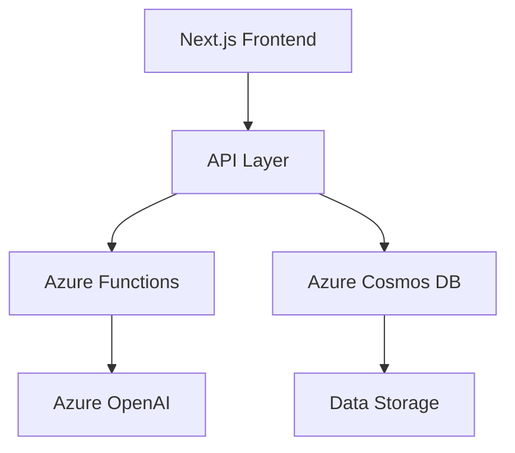

# Medication Management System Architecture

## System Overview

A Next.js-based medication management system with TypeScript, designed for Azure cloud deployment, focusing on core functionality with a path to full feature implementation.



## Core Architecture Components

### 1. Frontend Architecture (Next.js)

```typescript
// App Directory Structure
app/
├── (auth)/           # Authentication routes (placeholder)
│   ├── login/
│   └── register/
├── (dashboard)/      # Protected routes
│   ├── admin/       # Admin dashboard
│   ├── patient/     # Patient dashboard
│   └── helper/      # Helper view
├── api/             # API routes
├── components/      # Shared components
└── lib/            # Utilities and shared logic
```

#### Key Components

```typescript
// Component Architecture
components/
├── medication/
│   ├── MedicationForm.tsx      # Add/Edit medication
│   ├── MedicationList.tsx      # Display medications
│   ├── MedicationDetails.tsx   # Single medication view
│   └── MedicationSchedule.tsx  # Schedule display
├── adherence/
│   ├── AdherenceLog.tsx        # Logging component
│   ├── AdherenceChart.tsx      # Visualization
│   └── AdherenceAlert.tsx      # Alert component
├── patient/
│   ├── PatientProfile.tsx      # Profile management
│   └── PatientList.tsx         # Admin view
└── shared/
    ├── Layout.tsx              # Common layout
    ├── Navigation.tsx          # Navigation menu
    └── AlertSystem.tsx         # Alert management
```

### 2. Data Models

#### Patient Model
```typescript
interface Patient {
  id: string;
  name: string;
  dateOfBirth: string;
  contact: {
    email: string;
    phone?: string;
  };
  medications: Medication[];
  adherenceHistory: AdherenceLog[];
  preferences: {
    alertMethods: AlertMethod[];
    timezone: string;
  };
}
```

#### Medication Model
```typescript
interface Medication {
  id: string;
  patientId: string;
  name: string;
  dosage: {
    amount: number;
    unit: string;
  };
  schedule: {
    frequency: string;
    times: string[];
    startDate: string;
    endDate?: string;
  };
  instructions: string;
  status: 'active' | 'completed' | 'discontinued';
  prescribedBy?: string;
  prescribedDate: string;
}
```

#### Adherence Log Model
```typescript
interface AdherenceLog {
  id: string;
  medicationId: string;
  patientId: string;
  timestamp: string;
  status: 'taken' | 'missed' | 'delayed';
  notes?: string;
}
```

### 3. API Layer

#### API Routes Structure
```typescript
api/
├── medications/
│   ├── route.ts              # GET, POST medications
│   ├── [id]/
│   │   └── route.ts         # GET, PUT, DELETE medication
│   └── adherence/
│       └── route.ts         # POST adherence logs
├── patients/
│   ├── route.ts             # GET, POST patients
│   └── [id]/
│       └── route.ts         # GET, PUT, DELETE patient
└── ai/
    └── medication-info/
        └── route.ts         # GET medication information
```

### 4. Integration Patterns

#### Azure Cosmos DB Integration
```typescript
// lib/db/cosmos.ts
export class CosmosDBClient {
  async connect(): Promise<void> {
    // Initialize connection
  }

  async queryDocuments<T>(
    containerId: string,
    query: string,
    parameters: any[]
  ): Promise<T[]> {
    // Query implementation
  }

  async createDocument<T>(
    containerId: string,
    document: T
  ): Promise<T> {
    // Create document
  }
}
```

#### Azure OpenAI Integration
```typescript
// lib/ai/openai.ts
export class MedicationAIService {
  async getMedicationInfo(
    medicationName: string
  ): Promise<MedicationInfo> {
    // OpenAI query implementation
  }

  async checkInteractions(
    medications: string[]
  ): Promise<InteractionResult> {
    // Interaction check implementation
  }
}
```

### 5. State Management

```typescript
// lib/state/MedicationContext.tsx
interface MedicationState {
  medications: Medication[];
  adherenceLogs: AdherenceLog[];
  loading: boolean;
  error: Error | null;
}

const MedicationContext = createContext<{
  state: MedicationState;
  dispatch: Dispatch<MedicationAction>;
}>(initialState);
```

## Implementation Phases

### Phase 1: Core Foundation
1. Basic Next.js setup with TypeScript
2. Component structure implementation
3. Mock data layer with local storage
4. Basic UI components

### Phase 2: Data Layer
1. Cosmos DB integration
2. API routes implementation
3. Data models and validation
4. Error handling

### Phase 3: AI Integration
1. Azure OpenAI setup
2. Medication information retrieval
3. Basic interaction checking
4. AI response caching

### Phase 4: Advanced Features
1. Authentication implementation
2. Real-time alerts
3. Advanced adherence tracking
4. Mobile responsiveness

## Security Considerations

1. **Data Protection**
   - Encryption at rest (Cosmos DB)
   - TLS for data in transit
   - Secure API key storage

2. **Access Control**
   - Role-based access (future)
   - API route protection
   - Input validation

3. **Monitoring**
   - Error logging
   - Usage analytics
   - Performance monitoring

## Performance Optimization

1. **Frontend**
   - Static generation where possible
   - Dynamic imports for large components
   - Image optimization

2. **Backend**
   - API response caching
   - Efficient Cosmos DB queries
   - Connection pooling

3. **Data Access**
   - Pagination implementation
   - Optimistic updates
   - Background data fetching

## Development Guidelines

1. **Code Organization**
   - Feature-based structure
   - Shared utilities in lib/
   - Type definitions in types/

2. **Testing Strategy**
   - Unit tests for components
   - API route testing
   - Integration tests for key flows

3. **Documentation**
   - Component documentation
   - API documentation
   - Setup instructions

## Deployment Strategy

1. **Environment Configuration**
   - Development variables
   - Production secrets
   - Feature flags

2. **Azure Resources**
   - Static Web App
   - Cosmos DB
   - Azure Functions
   - Azure OpenAI

3. **CI/CD Pipeline**
   - GitHub Actions
   - Automated testing
   - Staged deployments