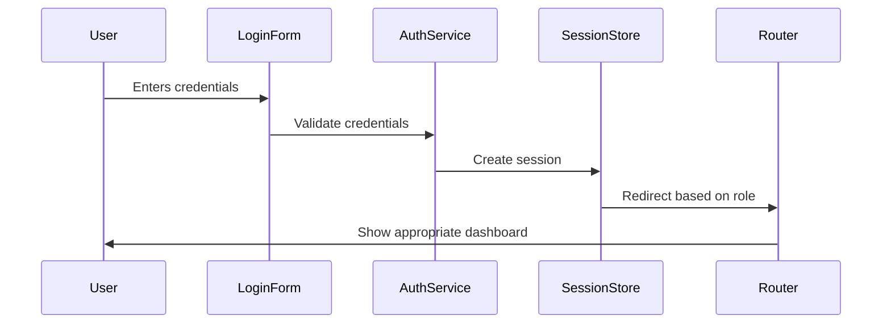

# Authentication and Role-Based Routing Architecture

## Status
Proposed

## Context
The application requires:
1. A login system for three user roles:
   - Patient
   - Medicine Administrator
   - Patient Helper
2. Role-based routing to different dashboards
3. Session management
4. Future integration with Azure AD

## Decision Drivers
1. Security: Protect user data and access
2. Simplicity: Easy to implement and maintain
3. Scalability: Support future authentication methods
4. User Experience: Smooth login and role switching

## Architecture Overview



## Implementation Strategy

### 1. Authentication Flow

```typescript
// auth/login/page.tsx
export default function LoginPage() {
  const [email, setEmail] = useState('')
  const [password, setPassword] = useState('')

  const handleLogin = async () => {
    try {
      const response = await fetch('/api/auth/login', {
        method: 'POST',
        body: JSON.stringify({ email, password })
      })
      
      if (response.ok) {
        const { role } = await response.json()
        router.push(`/${role}`)
      }
    } catch (error) {
      // Handle error
    }
  }

  return (
    <form onSubmit={handleLogin}>
      <input
        type="email"
        value={email}
        onChange={(e) => setEmail(e.target.value)}
      />
      <input
        type="password"
        value={password}
        onChange={(e) => setPassword(e.target.value)}
      />
      <button type="submit">Login</button>
    </form>
  )
}
```

### 2. Role-Based Routing

```typescript
// app/layout.tsx
export default function Layout({ children }: { children: React.ReactNode }) {
  const { role } = useSession()
  
  return (
    <div>
      <Navigation role={role} />
      <main>{children}</main>
    </div>
  )
}
```

### 3. Session Management

```typescript
// lib/auth/session.ts
interface Session {
  userId: string
  role: 'patient' | 'admin' | 'helper'
  expiresAt: Date
}

export function createSession(user: User): Session {
  return {
    userId: user.id,
    role: user.role,
    expiresAt: new Date(Date.now() + 1000 * 60 * 60 * 24) // 24 hours
  }
}
```

### 4. Protected Routes

```typescript
// middleware.ts
export function middleware(request: NextRequest) {
  const session = getSession(request)
  
  if (!session) {
    return NextResponse.redirect(new URL('/login', request.url))
  }
  
  if (!request.nextUrl.pathname.startsWith(`/${session.role}`)) {
    return NextResponse.redirect(new URL(`/${session.role}`, request.url))
  }
}
```

## Data Models

### User Model
```typescript
interface User {
  id: string
  email: string
  passwordHash: string
  role: 'patient' | 'admin' | 'helper'
  createdAt: Date
  updatedAt: Date
}
```

### Session Model
```typescript
interface Session {
  id: string
  userId: string
  role: 'patient' | 'admin' | 'helper'
  expiresAt: Date
  createdAt: Date
}
```

## Security Considerations

1. **Password Security**
   - Use bcrypt for password hashing
   - Implement password strength requirements
   - Add password reset functionality

2. **Session Security**
   - Use secure cookies
   - Implement session expiration
   - Add session invalidation on logout

3. **Rate Limiting**
   - Implement login attempt limits
   - Add CAPTCHA for repeated failures
   - Monitor suspicious activity

## Future Enhancements

1. **Azure AD Integration**
   - Support enterprise login
   - Implement SSO capabilities
   - Add MFA support

2. **Role Management**
   - Add role hierarchy
   - Implement permission levels
   - Add role switching

3. **Audit Logging**
   - Track login attempts
   - Monitor session activity
   - Log role changes

## Implementation Phases

### Phase 1: Basic Authentication
1. Login form implementation
2. Session management
3. Role-based routing

### Phase 2: Security Enhancements
1. Password security
2. Session security
3. Rate limiting

### Phase 3: Advanced Features
1. Azure AD integration
2. Role management
3. Audit logging

## References
1. [Next.js Authentication Documentation](https://nextjs.org/docs/authentication)
2. [Azure AD Integration Guide](https://learn.microsoft.com/en-us/azure/active-directory/develop/quickstart-v2-nextjs)
3. [OWASP Authentication Cheatsheet](https://cheatsheetseries.owasp.org/cheatsheets/Authentication_Cheat_Sheet.html)