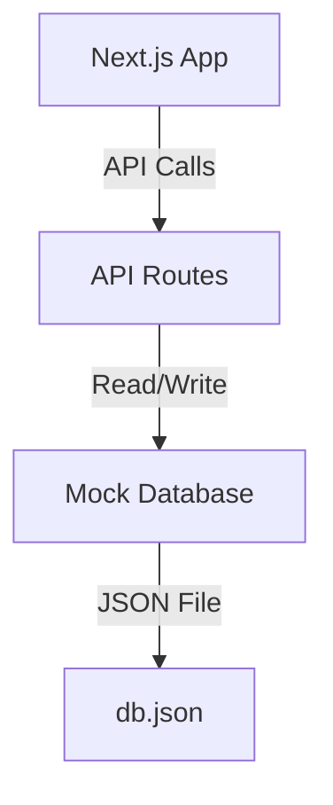
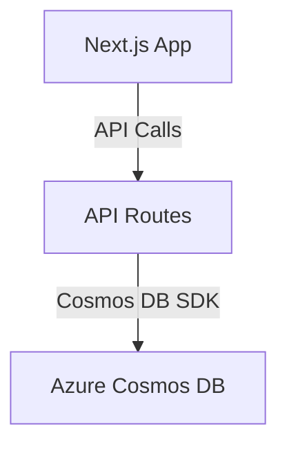

# Database Strategy and Implementation Plan

## Status
Proposed

## Context
The application requires:
1. Local development environment with mock database
2. Smooth transition to Azure Cosmos DB in production
3. Consistent data access patterns across environments
4. Easy testing and development workflows

## Decision Drivers
1. Development Efficiency: Enable rapid local development
2. Consistency: Maintain same data access patterns across environments
3. Transition Readiness: Easy migration to Cosmos DB
4. Testability: Support comprehensive testing

## Architecture Overview

### Local Development Architecture


### Production Architecture


## Implementation Plan

### Phase 1: Mock Database Implementation
1. Create `db.json` file in root directory
2. Define initial schema:
```json
{
  "users": [],
  "medications": [],
  "prescriptions": [],
  "adherenceRecords": []
}
```
3. Create data access layer:
   - `lib/db.ts` with CRUD operations
   - Uses `fs` module for file operations
4. Update API routes to use mock database

### Phase 2: Cosmos DB Integration
1. Create Azure Cosmos DB instance
2. Install Cosmos DB SDK:
```bash
npm install @azure/cosmos
```
3. Create `lib/cosmos.ts` with:
   - Connection configuration
   - Container initialization
   - Data access methods
4. Update environment variables:
   - `COSMOS_ENDPOINT`
   - `COSMOS_KEY`
   - `COSMOS_DATABASE`
   - `COSMOS_CONTAINER`
5. Implement environment-specific data access:
```typescript
const db = process.env.NODE_ENV === 'production' 
  ? cosmosDB 
  : mockDB
```

## Migration Strategy
1. Export mock data from `db.json`
2. Use Cosmos DB Data Migration Tool
3. Validate data integrity
4. Update environment variables for production

## Testing Strategy
1. Unit tests for data access layer
2. Integration tests for API routes
3. End-to-end tests for critical workflows
4. Mock database for local testing
5. Cosmos DB emulator for staging environment

## Future Considerations
1. Database indexing strategies
2. Partitioning and scaling
3. Backup and recovery
4. Monitoring and alerts