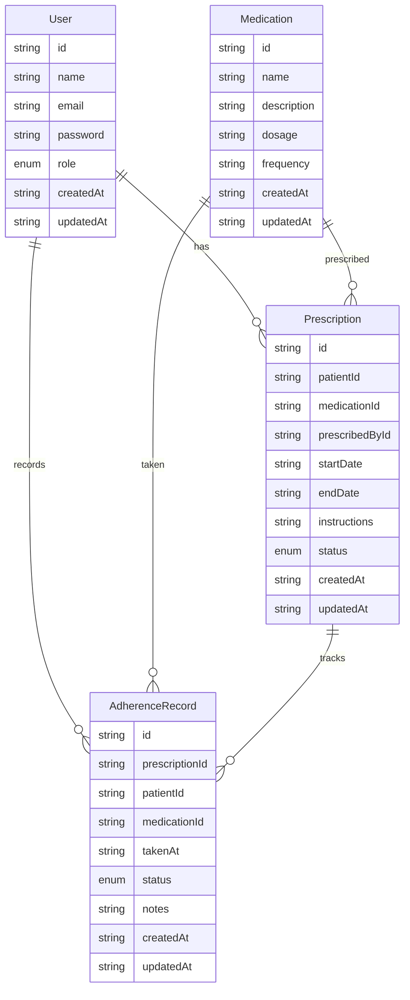

# Data Models and Relationships

## Overview

This document explains the data structures used in our application and how they relate to each other. Understanding these relationships is crucial for working with the database effectively.

## Data Models

### User Model
```typescript
interface User {
  id: string            // Unique identifier
  name: string          // User's full name
  email: string         // User's email (unique)
  password: string      // Hashed password
  role: "patient" | "admin" | "helper"  // User's role
  createdAt: string     // Creation timestamp
  updatedAt: string     // Last update timestamp
}
```

### Medication Model
```typescript
interface Medication {
  id: string            // Unique identifier
  name: string          // Medication name
  description: string   // Detailed description
  dosage: string        // Dosage information
  frequency: string     // How often to take
  createdAt: string     // Creation timestamp
  updatedAt: string     // Last update timestamp
}
```

### Prescription Model
```typescript
interface Prescription {
  id: string            // Unique identifier
  patientId: string     // References User with role="patient"
  medicationId: string  // References Medication
  prescribedById: string // References User with role="admin"
  startDate: string     // When to start medication
  endDate: string       // When to stop medication
  instructions: string  // Special instructions
  status: "active" | "completed" | "cancelled"
  createdAt: string     // Creation timestamp
  updatedAt: string     // Last update timestamp
}
```

### Adherence Record Model
```typescript
interface AdherenceRecord {
  id: string            // Unique identifier
  prescriptionId: string // References Prescription
  patientId: string     // References User with role="patient"
  medicationId: string  // References Medication
  takenAt: string       // When medication was taken
  status: "taken" | "missed" | "delayed"
  notes?: string        // Optional notes
  createdAt: string     // Creation timestamp
  updatedAt: string     // Last update timestamp
}
```

## Relationships Diagram



## Example Scenarios

### 1. Creating a New Prescription

When a medicine administrator creates a prescription:

```typescript
// 1. First, ensure all referenced entities exist
const patient = await db.users.read(patientId);
const medication = await db.medications.read(medicationId);
const admin = await db.users.read(adminId);

if (!patient || patient.role !== "patient") {
  throw new Error("Invalid patient");
}

if (!admin || admin.role !== "admin") {
  throw new Error("Invalid administrator");
}

if (!medication) {
  throw new Error("Invalid medication");
}

// 2. Create the prescription
const prescription = await db.prescriptions.create({
  patientId: patient.id,
  medicationId: medication.id,
  prescribedById: admin.id,
  startDate: "2024-01-26T00:00:00Z",
  endDate: "2024-02-26T00:00:00Z",
  instructions: "Take with food",
  status: "active"
});
```

### 2. Recording Medication Adherence

When a patient records taking their medication:

```typescript
// 1. Find active prescription
const prescription = await db.prescriptions.read(prescriptionId);
if (!prescription || prescription.status !== "active") {
  throw new Error("No active prescription found");
}

// 2. Record adherence
const adherenceRecord = await db.adherenceRecords.create({
  prescriptionId: prescription.id,
  patientId: prescription.patientId,
  medicationId: prescription.medicationId,
  takenAt: new Date().toISOString(),
  status: "taken",
  notes: "Taken with breakfast"
});
```

## Common Queries

### 1. Get Patient's Active Prescriptions
```typescript
const activePresciptions = await db.prescriptions.query({
  patientId: currentUserId,
  status: "active"
});
```

### 2. Get Patient's Adherence History
```typescript
const adherenceHistory = await db.adherenceRecords.query({
  patientId: currentUserId
});
```

### 3. Get All Patients for a Helper
```typescript
// First get all prescriptions where helper is assigned
const prescriptions = await db.prescriptions.query({
  helperId: currentHelperId
});

// Then get unique patient IDs
const patientIds = [...new Set(prescriptions.map(p => p.patientId))];

// Finally get patient details
const patients = await Promise.all(
  patientIds.map(id => db.users.read(id))
);
```

## Best Practices

1. **Always Validate References**: Before creating records that reference other entities, ensure those entities exist and are valid.

2. **Check Permissions**: Verify that users have appropriate roles before allowing operations.

3. **Maintain Consistency**: When updating related records, ensure all references remain valid.

4. **Use Transactions**: In a real database, use transactions when updating multiple related records to maintain data consistency.

5. **Handle Cascading**: Consider what happens to related records when deleting an entity (e.g., what happens to prescriptions when a medication is deleted).

## Migration to Production Database

When migrating to Azure Cosmos DB:

1. **Data Migration**:
   - Export all records from db.json
   - Transform data if needed
   - Import into Cosmos DB containers

2. **Schema Updates**:
   - Add database-specific fields (e.g., partition keys)
   - Update timestamps to use database native types
   - Add indexes for common queries

3. **Code Updates**:
   - Replace file operations with Cosmos DB SDK calls
   - Add proper error handling for database operations
   - Implement connection pooling and retry logic

This structure provides a foundation for building a scalable medication management system while keeping the development process simple and understandable.