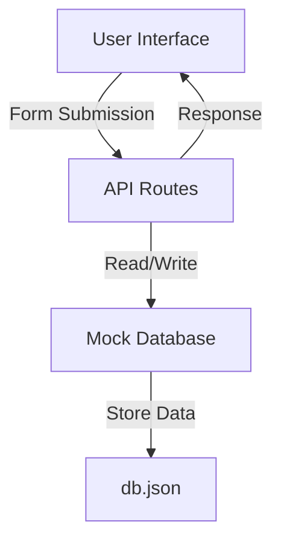
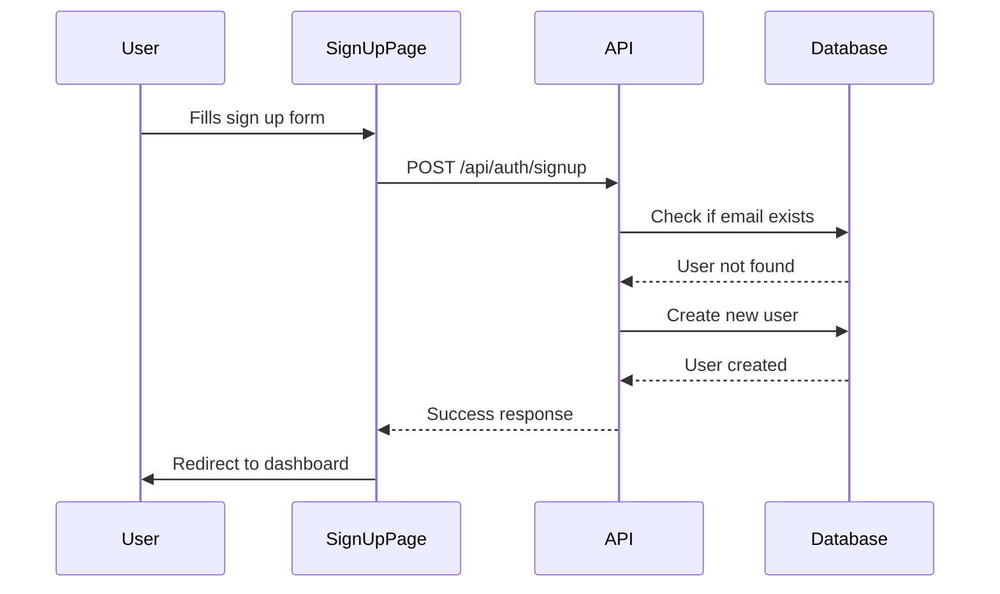
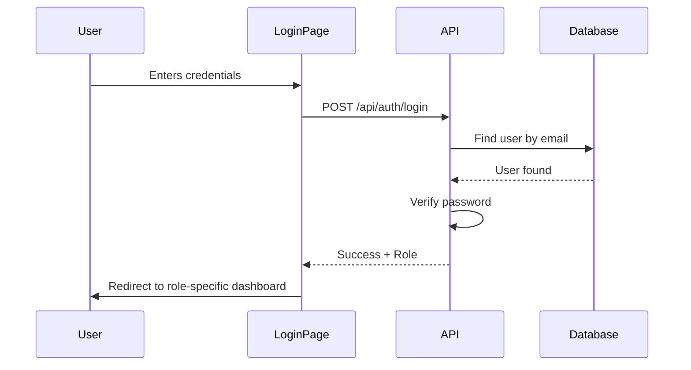

# Database and Authentication System Documentation

## Table of Contents
1. [Overview](#overview)
2. [Database Structure](#database-structure)
3. [Authentication Flow](#authentication-flow)
4. [Code Examples](#code-examples)
5. [Step-by-Step Guide](#step-by-step-guide)

## Overview

This document explains how our mock database works with the login and signup system. We'll break down each component and explain how they work together.

### Key Components:


## Database Structure

### What is a Mock Database?
A mock database is a simplified version of a real database that stores data in a JSON file. We use this during development because it's:
- Easy to understand
- Requires no setup
- Perfect for learning and prototyping

### Our Database File (db.json)
```json
{
  "users": [
    {
      "id": "unique-id-1",
      "name": "John Doe",
      "email": "john@example.com",
      "password": "hashedPassword",
      "role": "patient",
      "createdAt": "2024-01-26T...",
      "updatedAt": "2024-01-26T..."
    }
  ],
  "medications": [],
  "prescriptions": [],
  "adherenceRecords": []
}
```

### Database Operations (src/lib/db.ts)
We've created helper functions to interact with the database:
```typescript
// Example of database operations
const db = {
  users: {
    create: (data) => { /* Creates new user */ },
    read: (id) => { /* Gets user by ID */ },
    update: (id, data) => { /* Updates user */ },
    delete: (id) => { /* Deletes user */ },
    query: (filters) => { /* Finds users matching filters */ }
  }
  // Similar operations for medications, prescriptions, etc.
}
```

## Authentication Flow

### Sign Up Process


1. User enters information:
   - Name
   - Email
   - Password
   - Role (Patient/Admin/Helper)

2. Frontend sends data to API:
```typescript
// src/app/signup/page.tsx
const handleSubmit = async (e: React.FormEvent) => {
  const response = await fetch("/api/auth/signup", {
    method: "POST",
    body: JSON.stringify({ name, email, password, role })
  });
}
```

3. API processes request:
```typescript
// src/app/api/auth/signup/route.ts
export async function POST(request: NextRequest) {
  const { name, email, password, role } = await request.json();
  
  // Check if user exists
  const existingUser = await db.users.query({ email });
  if (existingUser) throw new Error("User exists");
  
  // Create new user
  const user = await db.users.create({
    name, email, password, role
  });
  
  return NextResponse.json({ user });
}
```

### Login Process


1. User enters credentials:
   - Email
   - Password
   - Role

2. Frontend sends login request:
```typescript
// src/app/login/page.tsx
const handleSubmit = async (e: React.FormEvent) => {
  const response = await fetch("/api/auth/login", {
    method: "POST",
    body: JSON.stringify({ email, password, role })
  });
}
```

3. API verifies credentials:
```typescript
// src/app/api/auth/login/route.ts
export async function POST(request: NextRequest) {
  const { email, password, role } = await request.json();
  
  // Find user
  const user = await db.users.query({ email, role });
  if (!user) throw new Error("Invalid credentials");
  
  // In production: Compare hashed passwords
  
  return NextResponse.json({ user });
}
```

## Step-by-Step Guide

### How to Add a New User

1. User fills out signup form at `/signup`
2. Frontend code collects form data:
```typescript
const formData = {
  name: "John Doe",
  email: "john@example.com",
  password: "secretpassword",
  role: "patient"
};
```

3. Data is sent to API endpoint
4. API creates new user in database:
```typescript
const newUser = await db.users.create({
  ...formData,
  id: crypto.randomUUID(),
  createdAt: new Date().toISOString(),
  updatedAt: new Date().toISOString()
});
```

5. User is redirected to appropriate dashboard

### How to Log In

1. User enters credentials at `/login`
2. Frontend sends credentials to API
3. API checks database for matching user:
```typescript
const user = await db.users.query({
  email: formData.email,
  role: formData.role
});
```

4. If found, user is redirected to their dashboard:
   - Patients → `/patient/dashboard`
   - Admins → `/admin/dashboard`
   - Helpers → `/helper/dashboard`

## Next.js Integration

### API Routes
Next.js provides a file-based routing system for APIs:
- `src/app/api/auth/login/route.ts` → `/api/auth/login`
- `src/app/api/auth/signup/route.ts` → `/api/auth/signup`

### Server Components
Next.js 13+ uses React Server Components by default. We mark our auth pages as client components using "use client" because they need interactivity:
```typescript
"use client";

export default function LoginPage() {
  // Component code
}
```

### Data Flow
1. User interaction triggers client-side code
2. Client code calls API route
3. API route interacts with database
4. Database returns data
5. API sends response to client
6. Client updates UI or redirects user

## Production Considerations

When moving to production:
1. Replace `db.json` with Azure Cosmos DB
2. Add password hashing
3. Implement proper session management
4. Add rate limiting
5. Enable email verification
6. Implement password reset functionality

The current mock database provides a foundation for learning these concepts before implementing a full production system.