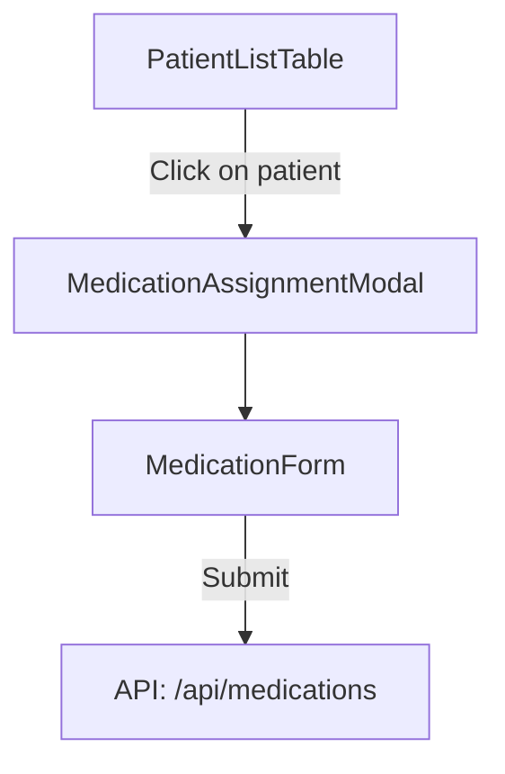

# Medication Assignment and Verification Preferences Implementation Plan

## Overview

This document outlines the implementation plan for a feature that allows administrators to assign medications to patients and set verification preferences for those medications. The feature will be accessible from the admin dashboard by clicking on a patient in the PatientListTable.

## Requirements

1. Administrators should be able to click on a patient in the PatientListTable to open a popup modal
2. The modal should allow administrators to:
   - Assign medication to the selected patient
   - Set verification preferences for that medication
3. Required medication fields:
   - Name
   - Dosage
   - Frequency
   - Route of administration
   - Start date
   - End date
4. Optional medication fields:
   - Prescribing doctor
   - Pharmacy
   - Notes
   - Refills remaining
   - Last filled date
5. Verification methods:
   - Manual entry
   - Live feed verification
   - Patient Helper Verification
6. The modal should include validation for required fields and date validation
7. After assigning a medication, the administrator should stay on the current view (the modal)

## Database Changes

We will add a new property to the MEDICATIONS table:

```
verificationMethod: String (Enum: 'manual-entry', 'live-feed', 'patient-helper')
```

## Component Structure



## Implementation Steps

### 1. Update PatientListTable Component

Modify the PatientListTable component to:
- Add a click handler for each patient row
- Create a state for the selected patient
- Add a modal component that appears when a patient is selected

```typescript
// src/components/PatientListTable.tsx

import { useState } from "react"
import { Search, MoreVertical, AlertCircle, CheckCircle } from "lucide-react"
import MedicationAssignmentModal from "./MedicationAssignmentModal"

// ... existing code ...

const PatientListTable = () => {
  const [searchTerm, setSearchTerm] = useState("")
  const [sortField, setSortField] = useState<keyof Patient>("name")
  const [sortDirection, setSortDirection] = useState<"asc" | "desc">("asc")
  const [selectedPatient, setSelectedPatient] = useState<Patient | null>(null)

  // ... existing code ...

  const handlePatientClick = (patient: Patient) => {
    setSelectedPatient(patient)
  }

  const handleCloseModal = () => {
    setSelectedPatient(null)
  }

  return (
    <div className="bg-white rounded-lg shadow-md">
      {/* ... existing code ... */}
      
      <tbody className="bg-white divide-y divide-gray-200">
        {filteredPatients.map((patient) => (
          <tr 
            key={patient.id} 
            className="hover:bg-gray-50 cursor-pointer"
            onClick={() => handlePatientClick(patient)}
          >
            {/* ... existing code ... */}
          </tr>
        ))}
      </tbody>
      
      {/* Medication Assignment Modal */}
      {selectedPatient && (
        <MedicationAssignmentModal
          patient={selectedPatient}
          onClose={handleCloseModal}
        />
      )}
    </div>
  )
}

export default PatientListTable
```

### 2. Create MedicationAssignmentModal Component

Create a new modal component that:
- Receives the selected patient as a prop
- Contains a form for medication details with validation
- Includes a dropdown for verification method selection
- Has save and cancel buttons

```typescript
// src/components/MedicationAssignmentModal.tsx

import { useState, FormEvent } from 'react'
import { X } from 'lucide-react'

interface Patient {
  id: string
  name: string
  // ... other patient properties
}

interface MedicationAssignmentModalProps {
  patient: Patient
  onClose: () => void
}

const MedicationAssignmentModal = ({ patient, onClose }: MedicationAssignmentModalProps) => {
  // Form state
  const [name, setName] = useState('')
  const [dosage, setDosage] = useState('')
  const [frequency, setFrequency] = useState('')
  const [route, setRoute] = useState('')
  const [startDate, setStartDate] = useState('')
  const [endDate, setEndDate] = useState('')
  const [verificationMethod, setVerificationMethod] = useState('')
  
  // Optional fields
  const [prescribingDoctor, setPrescribingDoctor] = useState('')
  const [pharmacy, setPharmacy] = useState('')
  const [notes, setNotes] = useState('')
  const [refillsRemaining, setRefillsRemaining] = useState('')
  const [lastFilled, setLastFilled] = useState('')
  
  // Form state
  const [isSubmitting, setIsSubmitting] = useState(false)
  const [error, setError] = useState('')
  const [success, setSuccess] = useState('')
  
  // Validation errors
  const [dateError, setDateError] = useState('')
  
  const validateForm = () => {
    // Reset errors
    setError('')
    setDateError('')
    
    // Check required fields
    if (!name || !dosage || !frequency || !route || !startDate || !endDate || !verificationMethod) {
      setError('Please fill in all required fields')
      return false
    }
    
    // Validate dates
    const start = new Date(startDate)
    const end = new Date(endDate)
    if (end < start) {
      setDateError('End date must be after start date')
      return false
    }
    
    return true
  }
  
  const handleSubmit = async (e: FormEvent) => {
    e.preventDefault()
    
    if (!validateForm()) {
      return
    }
    
    setIsSubmitting(true)
    
    try {
      const response = await fetch('/api/medications', {
        method: 'POST',
        headers: {
          'Content-Type': 'application/json',
        },
        body: JSON.stringify({
          patientId: patient.id,
          name,
          dosage,
          frequency,
          route,
          startDate,
          endDate,
          verificationMethod,
          prescribingDoctor,
          pharmacy,
          notes,
          refillsRemaining: refillsRemaining ? parseInt(refillsRemaining) : 0,
          lastFilled: lastFilled || null
        }),
      })
      
      if (!response.ok) {
        const data = await response.json()
        throw new Error(data.error || 'Failed to create medication')
      }
      
      setSuccess('Medication assigned successfully')
      
      // Reset form
      setName('')
      setDosage('')
      setFrequency('')
      setRoute('')
      setStartDate('')
      setEndDate('')
      setVerificationMethod('')
      setPrescribingDoctor('')
      setPharmacy('')
      setNotes('')
      setRefillsRemaining('')
      setLastFilled('')
      
    } catch (err) {
      setError(err.message || 'An error occurred')
    } finally {
      setIsSubmitting(false)
    }
  }
  
  return (
    <div className="fixed inset-0 bg-black bg-opacity-50 flex items-center justify-center z-50">
      <div className="bg-white rounded-lg shadow-xl w-full max-w-3xl max-h-[90vh] overflow-y-auto">
        <div className="flex items-center justify-between p-4 border-b">
          <h2 className="text-xl font-semibold text-gray-800">
            Assign Medication for {patient.name}
          </h2>
          <button 
            onClick={onClose}
            className="text-gray-500 hover:text-gray-700"
          >
            <X className="h-6 w-6" />
          </button>
        </div>
        
        <div className="p-6">
          {error && (
            <div className="mb-4 p-3 bg-red-100 text-red-700 rounded">
              {error}
            </div>
          )}
          
          {success && (
            <div className="mb-4 p-3 bg-green-100 text-green-700 rounded">
              {success}
            </div>
          )}
          
          <form onSubmit={handleSubmit}>
            <div className="grid grid-cols-1 md:grid-cols-2 gap-4 mb-6">
              {/* Required Fields */}
              <div className="col-span-2">
                <h3 className="text-lg font-medium mb-2">Medication Details</h3>
              </div>
              
              <div>
                <label className="block text-sm font-medium text-gray-700 mb-1">
                  Medication Name *
                </label>
                <input
                  type="text"
                  value={name}
                  onChange={(e) => setName(e.target.value)}
                  className="w-full p-2 border rounded focus:ring-blue-500 focus:border-blue-500"
                  required
                />
              </div>
              
              <div>
                <label className="block text-sm font-medium text-gray-700 mb-1">
                  Dosage *
                </label>
                <input
                  type="text"
                  value={dosage}
                  onChange={(e) => setDosage(e.target.value)}
                  className="w-full p-2 border rounded focus:ring-blue-500 focus:border-blue-500"
                  required
                />
              </div>
              
              <div>
                <label className="block text-sm font-medium text-gray-700 mb-1">
                  Frequency *
                </label>
                <select
                  value={frequency}
                  onChange={(e) => setFrequency(e.target.value)}
                  className="w-full p-2 border rounded focus:ring-blue-500 focus:border-blue-500"
                  required
                >
                  <option value="">Select frequency</option>
                  <option value="daily">Daily</option>
                  <option value="twice-daily">Twice Daily</option>
                  <option value="weekly">Weekly</option>
                  <option value="as-needed">As Needed</option>
                </select>
              </div>
              
              <div>
                <label className="block text-sm font-medium text-gray-700 mb-1">
                  Route of Administration *
                </label>
                <select
                  value={route}
                  onChange={(e) => setRoute(e.target.value)}
                  className="w-full p-2 border rounded focus:ring-blue-500 focus:border-blue-500"
                  required
                >
                  <option value="">Select route</option>
                  <option value="oral">Oral</option>
                  <option value="topical">Topical</option>
                  <option value="injection">Injection</option>
                  <option value="inhalation">Inhalation</option>
                </select>
              </div>
              
              <div>
                <label className="block text-sm font-medium text-gray-700 mb-1">
                  Start Date *
                </label>
                <input
                  type="date"
                  value={startDate}
                  onChange={(e) => setStartDate(e.target.value)}
                  className="w-full p-2 border rounded focus:ring-blue-500 focus:border-blue-500"
                  required
                />
              </div>
              
              <div>
                <label className="block text-sm font-medium text-gray-700 mb-1">
                  End Date *
                </label>
                <input
                  type="date"
                  value={endDate}
                  onChange={(e) => setEndDate(e.target.value)}
                  className="w-full p-2 border rounded focus:ring-blue-500 focus:border-blue-500"
                  required
                />
                {dateError && (
                  <p className="mt-1 text-sm text-red-600">{dateError}</p>
                )}
              </div>
              
              <div>
                <label className="block text-sm font-medium text-gray-700 mb-1">
                  Verification Method *
                </label>
                <select
                  value={verificationMethod}
                  onChange={(e) => setVerificationMethod(e.target.value)}
                  className="w-full p-2 border rounded focus:ring-blue-500 focus:border-blue-500"
                  required
                >
                  <option value="">Select verification method</option>
                  <option value="manual-entry">Manual Entry</option>
                  <option value="live-feed">Live Feed Verification</option>
                  <option value="patient-helper">Patient Helper Verification</option>
                </select>
              </div>
              
              {/* Optional Fields */}
              <div className="col-span-2 mt-4">
                <h3 className="text-lg font-medium mb-2">Additional Information (Optional)</h3>
              </div>
              
              <div>
                <label className="block text-sm font-medium text-gray-700 mb-1">
                  Prescribing Doctor
                </label>
                <input
                  type="text"
                  value={prescribingDoctor}
                  onChange={(e) => setPrescribingDoctor(e.target.value)}
                  className="w-full p-2 border rounded focus:ring-blue-500 focus:border-blue-500"
                />
              </div>
              
              <div>
                <label className="block text-sm font-medium text-gray-700 mb-1">
                  Pharmacy
                </label>
                <input
                  type="text"
                  value={pharmacy}
                  onChange={(e) => setPharmacy(e.target.value)}
                  className="w-full p-2 border rounded focus:ring-blue-500 focus:border-blue-500"
                />
              </div>
              
              <div>
                <label className="block text-sm font-medium text-gray-700 mb-1">
                  Refills Remaining
                </label>
                <input
                  type="number"
                  value={refillsRemaining}
                  onChange={(e) => setRefillsRemaining(e.target.value)}
                  min="0"
                  className="w-full p-2 border rounded focus:ring-blue-500 focus:border-blue-500"
                />
              </div>
              
              <div>
                <label className="block text-sm font-medium text-gray-700 mb-1">
                  Last Filled Date
                </label>
                <input
                  type="date"
                  value={lastFilled}
                  onChange={(e) => setLastFilled(e.target.value)}
                  className="w-full p-2 border rounded focus:ring-blue-500 focus:border-blue-500"
                />
              </div>
              
              <div className="col-span-2">
                <label className="block text-sm font-medium text-gray-700 mb-1">
                  Notes
                </label>
                <textarea
                  value={notes}
                  onChange={(e) => setNotes(e.target.value)}
                  rows={3}
                  className="w-full p-2 border rounded focus:ring-blue-500 focus:border-blue-500"
                />
              </div>
            </div>
            
            <div className="flex justify-end space-x-3 mt-6">
              <button
                type="button"
                onClick={onClose}
                className="px-4 py-2 border border-gray-300 rounded-md shadow-sm text-sm font-medium text-gray-700 bg-white hover:bg-gray-50 focus:outline-none focus:ring-2 focus:ring-offset-2 focus:ring-blue-500"
              >
                Cancel
              </button>
              <button
                type="submit"
                disabled={isSubmitting}
                className="px-4 py-2 border border-transparent rounded-md shadow-sm text-sm font-medium text-white bg-blue-600 hover:bg-blue-700 focus:outline-none focus:ring-2 focus:ring-offset-2 focus:ring-blue-500 disabled:opacity-50"
              >
                {isSubmitting ? 'Saving...' : 'Save Medication'}
              </button>
            </div>
          </form>
        </div>
      </div>
    </div>
  )
}

export default MedicationAssignmentModal
```

### 3. Update Medications API

Update the existing `/api/medications` endpoint to handle the new verificationMethod field:

```typescript
// src/app/api/medications/route.ts

import { NextResponse } from 'next/server';
import { MedicationService } from '@/lib/azure-tables';
import { OpenAIService } from '@/lib/openai-service';

// ... existing code ...

export async function POST(request: Request) {
  try {
    const body = await request.json();
    const { 
      patientId, 
      name, 
      dosage, 
      frequency, 
      route, 
      startDate, 
      endDate, 
      verificationMethod,
      prescribingDoctor, 
      pharmacy, 
      notes, 
      refillsRemaining, 
      lastFilled 
    } = body;

    // Handle simple medication creation
    if (patientId && name && dosage && frequency && route && startDate && endDate && verificationMethod) {
      // Validate dates
      const start = new Date(startDate);
      const end = new Date(endDate);
      if (end < start) {
        return NextResponse.json({ error: 'End date must be after start date' }, { status: 400 });
      }

      // Validate verification method
      const validMethods = ['manual-entry', 'live-feed', 'patient-helper'];
      if (!validMethods.includes(verificationMethod)) {
        return NextResponse.json({ error: 'Invalid verification method' }, { status: 400 });
      }

      const newMedication = {
        name,
        dosage,
        frequency,
        route,
        startDate,
        endDate,
        verificationMethod,
        prescribingDoctor: prescribingDoctor || '',
        pharmacy: pharmacy || '',
        notes: notes || '',
        refillsRemaining: refillsRemaining || 0,
        lastFilled: lastFilled || ''
      };
      
      await medicationService.addMedication(newMedication, patientId);
      return NextResponse.json({ 
        message: 'Medication created successfully',
        medication: {
          ...newMedication,
          patientId,
          status: 'pending'
        }
      });
    }

    // ... existing code for other actions ...
  } catch (error) {
    console.error('Error processing medication request:', error);
    // Log more details about the error
    if (error instanceof Error) {
      console.error('Error details:', {
        message: error.message,
        stack: error.stack,
        name: error.name
      });
    }
    return NextResponse.json(
      { error: 'Failed to process request', details: (error as Error).message },
      { status: 500 }
    );
  }
}
```

### 4. Update MedicationService

Update the MedicationService class to handle the new verificationMethod field:

```typescript
// src/lib/azure-tables.ts

export class MedicationService {
  // ... existing code ...

  async addMedication(medication: Omit<Medication, 'partitionKey' | 'rowKey'>, patientId: string): Promise<void> {
    const entity = {
      partitionKey: patientId,
      rowKey: `med-${Date.now()}-${Math.random().toString(36).substr(2, 9)}`,
      ...medication
    };

    try {
      await this.tableClient.createEntity(entity);
      console.log(`Added medication: ${medication.name}`);
    } catch (error) {
      console.error(`Error adding medication ${medication.name}:`, error);
      throw error;
    }
  }

  // ... existing code ...
}
```

### 5. Update Types

Update the types to include the new verificationMethod field:

```typescript
// src/lib/types.ts

export interface Medication {
  partitionKey: string;
  rowKey: string;
  name: string;
  dosage: string;
  frequency: string;
  route: string;
  startDate: string;
  endDate: string;
  verificationMethod: 'manual-entry' | 'live-feed' | 'patient-helper';
  prescribingDoctor?: string;
  pharmacy?: string;
  notes?: string;
  refillsRemaining?: number;
  lastFilled?: string;
}
```

## Testing Plan

1. **Unit Tests**:
   - Test form validation for medication fields
   - Test date validation logic
   - Test API endpoints with various input scenarios

2. **Integration Tests**:
   - Test the flow from patient selection to medication assignment
   - Test saving medication with verification preferences
   - Test error handling and validation messages

3. **Manual Testing**:
   - Verify the modal opens correctly when clicking on a patient
   - Verify all form fields work as expected
   - Verify validation errors are displayed appropriately
   - Verify data is saved correctly to the database

## Implementation Timeline

1. **Phase 1 (Day 1)**:
   - Update the PatientListTable component to handle patient selection
   - Create the MedicationAssignmentModal component

2. **Phase 2 (Day 2)**:
   - Update the Medications API to handle the new verificationMethod field
   - Update the MedicationService class
   - Update the types

3. **Phase 3 (Day 3)**:
   - Connect all components together
   - Implement error handling and loading states
   - Test the complete flow

4. **Phase 4 (Day 4)**:
   - Fix any bugs or issues
   - Optimize performance
   - Add any additional features or improvements

## Conclusion

This implementation plan provides a comprehensive approach to adding medication assignment and verification preferences functionality to the admin dashboard. By following this plan, we can create a user-friendly interface for administrators to manage patient medications and verification methods.