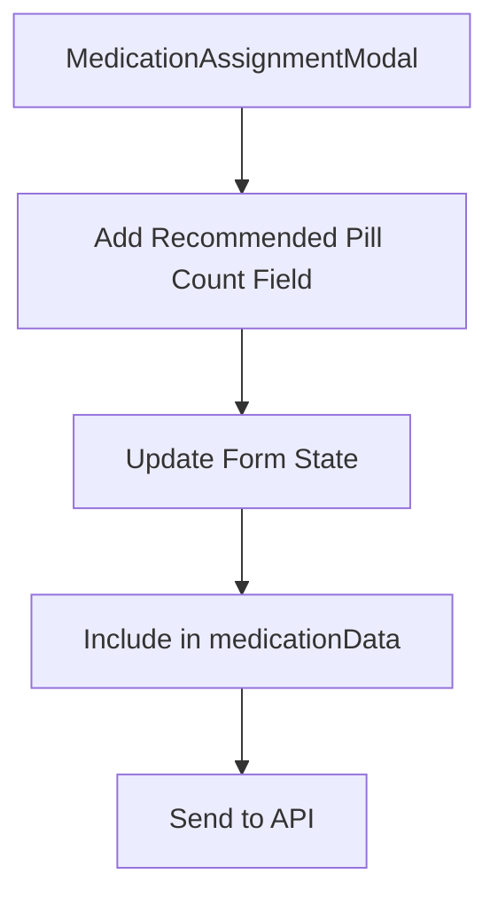
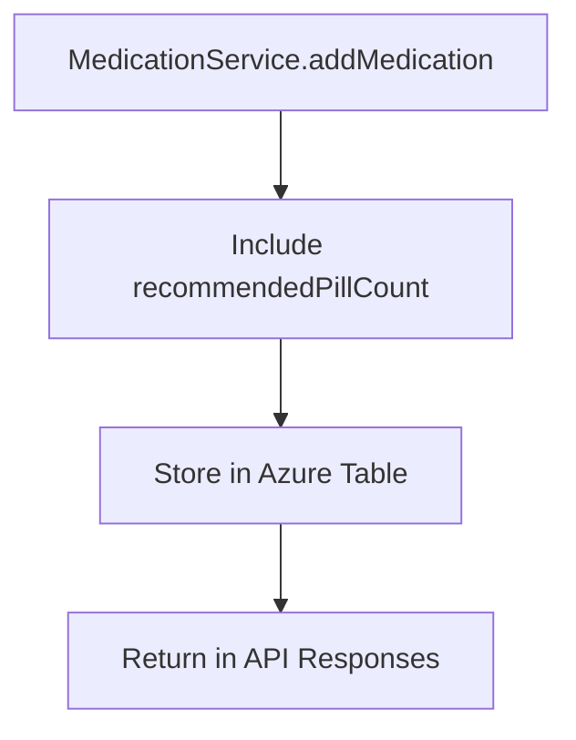
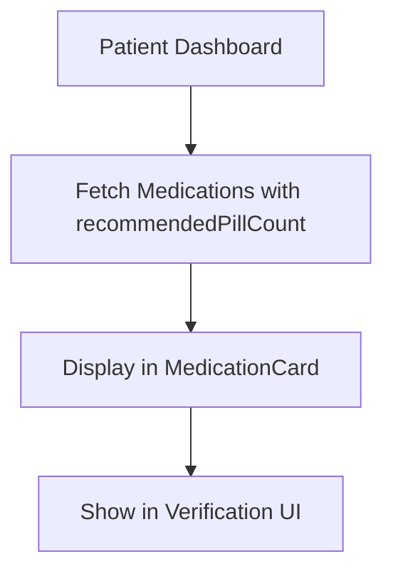
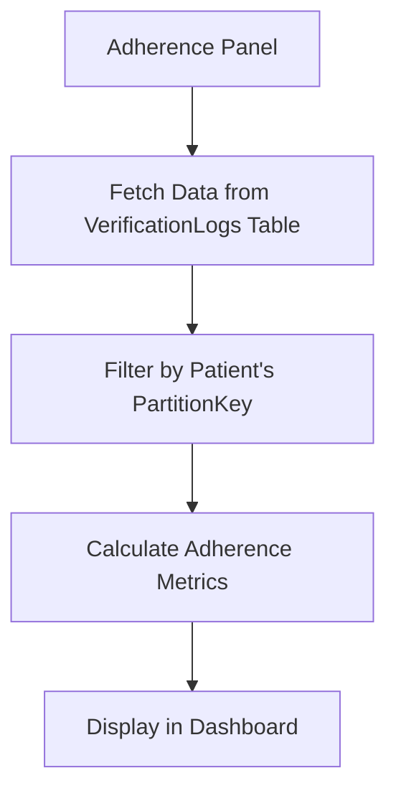

# Medication Adherence System Enhancement Plan

## Overview

This plan outlines the steps to enhance the medication adherence system by adding recommended pill count tracking and improving the adherence panel to work directly with the Azure Tables database.

## Current System Analysis

The current system has several limitations:

1. **Missing Recommended Pill Count**: The medication assignment form doesn't allow admins to specify how many pills a patient should take per dose.

2. **Incomplete Data Storage**: While the `Medication` interface in `azure-tables-types.ts` has a `recommendedPillCount` field, it's not being properly collected from the admin during medication assignment.

3. **Dashboard Limitations**: The patient dashboard doesn't clearly show the recommended pill count for each medication.

4. **Adherence Panel**: The current adherence panel may not be fully utilizing the Azure Tables database for tracking medication adherence.

## Proposed Changes

### 1. Update Medication Assignment Modal

Add a "Recommended Pill Count" field to the medication assignment form:



### 2. Update Database Schema and Storage

Ensure the recommended pill count is properly stored in the medications table:



### 3. Update Patient Dashboard

Enhance the patient dashboard to display the recommended pill count:



### 4. Improve Adherence Panel

Update the adherence panel to work directly with the Azure Tables database:



## Implementation Steps

1. **Modify MedicationAssignmentModal.tsx**:
   - Add a new form field for recommended pill count
   - Update state management and validation
   - Include the value in the API request

2. **Update Azure Tables Integration**:
   - Ensure the `recommendedPillCount` field is properly handled in the MedicationService
   - Update any related API endpoints

3. **Enhance MedicationCard Component**:
   - Update to display the recommended pill count
   - Improve the verification UI to show this information

4. **Update Adherence Panel**:
   - Modify the adherence panel to fetch data directly from the VerificationLogs table
   - Filter records by the logged-in patient's partition key
   - Calculate adherence metrics based on the verification logs
   - Display the adherence information in the dashboard

## Technical Details

### 1. MedicationAssignmentModal.tsx Changes

Add a new form field after the "Refills Remaining" field:

```jsx
{/* Recommended Pill Count */}
<div>
  <label className="block text-sm font-medium text-gray-700 mb-1" htmlFor="recommendedPillCount">
    Recommended Pill Count*
  </label>
  <input
    id="recommendedPillCount"
    type="text"
    pattern="\d*"
    value={recommendedPillCount}
    onChange={handleRecommendedPillCountChange}
    className="block w-full rounded-md border-gray-300 shadow-sm focus:border-blue-500 focus:ring-blue-500 sm:text-sm"
    placeholder="e.g., 1"
    required
  />
</div>
```

### 2. MedicationCard.tsx Enhancement

Update the medication card to display the recommended pill count:

```jsx
<div className="mt-2 text-sm text-gray-600">
  <span className="font-medium">Recommended dose:</span> {medication.recommendedPillCount || 1} pill(s)
</div>
```

### 3. Adherence Panel Implementation

The adherence panel will be updated to:

1. Fetch verification logs from the Azure Tables database
2. Filter logs by the logged-in patient's ID (partition key)
3. Calculate adherence metrics:
   - Adherence percentage
   - Streak of consecutive days with medications taken
   - Daily history of medication adherence
4. Display these metrics in the dashboard

## Benefits

1. **Improved Accuracy**: Better tracking of whether patients are taking the correct dosage
2. **Enhanced User Experience**: Clearer information for both admins and patients
3. **Data Integrity**: Proper storage and retrieval of medication dosage information
4. **Direct Database Integration**: Adherence panel working directly with the Azure Tables database instead of mocked data